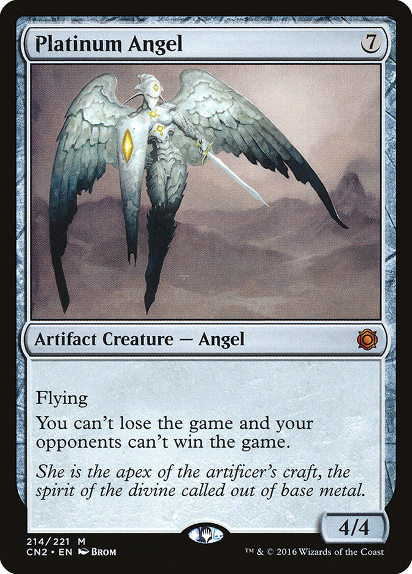

# MTG Card Analyzer

[](https://github.com/dills122/MTG-Card-Analyzer/actions/workflows/ci.action.yml)
[](https://www.codefactor.io/repository/github/dills122/mtg-card-analyzer)

MTG Card Analyzer is a Node.js CLI that identifies Magic: The Gathering cards from images. It
combines OCR, fuzzy name matching, and perceptual image hashes to find the likely card and
printing.

It is local-first: the card-name index, image-hash cache, scan history, and optional collection
data are stored on your machine by default. No MySQL server is needed for the normal workflow.

## What it does

- Scans one card image at a time from the command line.
- Extracts and normalizes the card name with Tesseract OCR.
- Fuzzy-matches imperfect OCR against a local card-name index.
- Compares card or set-symbol image hashes to distinguish printings.
- Prints candidates by default, with opt-in local collection tracking.
- Records a local operations log to help diagnose difficult scans.

Scans are dry runs by default: they print results without adding anything to your collection. The
local caches and operations log still update unless you disable the local cache.

## Quick start

You need:

- [Node.js](https://nodejs.org/) 20 or newer
- [pnpm](https://pnpm.io/installation) 8 or newer (the repository pins pnpm 10.13.1)
- Git and a network connection for installation and the initial Scryfall card-name seed

```bash
git clone https://github.com/dills122/MTG-Card-Analyzer.git
cd MTG-Card-Analyzer
node scripts/setup.mjs
node index.mjs scan ./test-images/PlatinumAngel.jpg
```

The setup script installs dependencies, creates local configuration files without overwriting
existing ones, and seeds the card-name index. On later runs, pass `--skip-seed` if the index is
already populated: the current seeder appends the Scryfall catalog and can create duplicate name
rows. Setup does not start MySQL unless you explicitly pass `--with-mysql`.

If the scan does not complete, check the environment before digging into individual settings:

```bash
node scripts/verify-env.mjs
```

See the [local setup guide](docs/LOCAL_DEV.md) for setup flags and troubleshooting.

## Common workflows

### Identify a card without changing your collection

```bash
node index.mjs scan ./path/to/card.jpg
```

You can also omit the `scan` word for backward compatibility:

```bash
node index.mjs ./path/to/card.jpg
```

### Save successful scans to a local collection

Collection tracking and writes are separate opt-ins. Set both once in `mtg.config.json` through the
CLI:

```bash
node index.mjs config set collectionEnabled true
node index.mjs config set queryingEnabled true
node index.mjs scan ./path/to/card.jpg
```

Or enable both for only one run:

```bash
node index.mjs scan ./path/to/card.jpg --enable-collection --query
```

### Inspect recent scan activity

```bash
node index.mjs log dump --limit 20
node index.mjs log stats
node index.mjs diagnostics
```

Run `node index.mjs --help` for the command list or see the
[CLI reference](docs/cli-reference.md) for every command and flag.

## How matching works

1. The image is validated and likely title regions are cropped and enhanced.
2. Tesseract extracts bounded title candidates with the segmentation mode declared by each crop.
3. All plausible OCR regions and lines are fuzzy-matched against the local card-name index;
   unambiguous individual face names resolve back to their canonical compound card name.
4. Failed title matches progressively try soft/inverted title variants, rotated title bands, and
   finally supplemental rules text, avoiding the extra OCR work for ordinary successful scans.
5. Candidate printings come from Scryfall and are ranked with cached or downloaded image hashes.
6. Results are printed and, only when enabled, a single confirmed printing is written to the
   collection backend. A resolved name with multiple possible sets is saved to needs-attention
   instead of being treated as confirmed.

The scan promise includes local cache/log completion and removal of its bounded OCR temporary
directory, so the CLI does not exit while those writes or cleanup operations are still pending.

<p align="center">
  
</p>

OCR quality varies with lighting, focus, rotation, framing, and card layout. The OCR minimum is
360 by 500 pixels; a smaller source within 2x of that is still upscaled and processed, and only a
source further below is rejected. Setup and printing lookup use Scryfall, so the scanner is
local-first rather than fully offline.

## Documentation

| If you want to...                                                | Read...                                               |
| ---------------------------------------------------------------- | ----------------------------------------------------- |
| Install the project or fix a local setup problem                 | [Local development setup](docs/LOCAL_DEV.md)          |
| Look up commands, flags, logging, migration, or collection edits | [CLI reference](docs/cli-reference.md)                |
| Change settings or understand local database files               | [Configuration and local data](docs/configuration.md) |
| Understand the scan pipeline and module boundaries               | [Architecture](docs/architecture.md)                  |
| Add or evaluate OCR and matching fixtures                        | [Regression testing](docs/regression-testing.md)      |
| Build a reviewed custom OCR fine-tuning corpus                   | [OCR training data](docs/ocr-training-data.md)        |
| Prepare a change or pull request                                 | [Contributing](CONTRIBUTING.md)                       |

The default NeDB backend is the recommended path. A legacy MySQL/RDS adapter remains available for
existing users; its setup and migration instructions live in the
[local development guide](docs/LOCAL_DEV.md#mysql--docker) and
[CLI reference](docs/cli-reference.md#migrate-local-data-to-mysqlrds).

## Development

After setup, run the standard local gate:

```bash
pnpm check
```

That runs formatting checks, linting, type checking, and unit tests. Changes to OCR preprocessing,
fuzzy matching, hashing, or print selection should also run:

```bash
pnpm test:regression
```

The unit suite is deterministic and does not require live Scryfall or MySQL access. See
[CONTRIBUTING.md](CONTRIBUTING.md) before opening a pull request.

## License

MTG Card Analyzer is available under the [MIT License](LICENSE).
