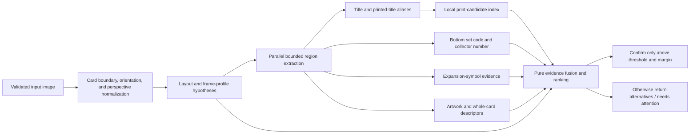

<!-- markdownlint-disable-file MD013 -->

# Card detection research spike

Date: 2026-08-11

## Implementation status

The first contract-and-benchmark slice is implemented:

- Scryfall print searches follow bounded, same-origin pagination.
- The matcher preserves print ID, set code, collector number, language, illustration, frame, treatment,
  finish-availability, and image metadata instead of reducing candidates to set names.
- Same-set variants remain distinct in match details and the hash cache.
- A lone API candidate and closest-image best guesses are explicitly unverified and cannot trigger a
  collection write.
- CLI output shows exact printing labels without exposing internal URLs.
- Regression expectations can assert `scryfallId`, and the benchmark reports exact-print verification.

Perspective normalization, collector-block OCR, candidate-specific symbol matching, and improved
regional artwork descriptors remain the next experimental slices.

## Decision

Evolve the scanner from a two-stage **name then set-name hash** pipeline into an explainable,
multi-signal **name then exact-print** pipeline. Keep the existing title OCR as candidate generation,
but identify a printing by combining independent evidence from:

1. normalized title and printed-title aliases;
2. bottom collector information when the frame has it;
3. expansion symbol when the frame has one;
4. registered artwork and whole-card visual similarity;
5. frame, border, layout, language, and treatment compatibility.

The ranker should return a Scryfall printing ID, set code, collector number, treatment metadata,
confidence, and evidence breakdown. It should abstain when the evidence cannot distinguish candidates.
The photographed finish (nonfoil, foil, etched, serialized, and similar) is a separate, often unknown
property and must not be inferred merely because Scryfall says a printing is available in that finish.

Do not begin with an end-to-end neural classifier or another broad Tesseract fine-tune. The repository
does not yet have a variant benchmark, the existing 22-line OCR training pilot introduced blocking
regressions, and deterministic geometry plus candidate-specific evidence is cheaper to test, easier to
explain, and better aligned with the local-first architecture.

## Questions this spike answers

- How can the scanner distinguish printings and treatments of the same named card?
- How can it detect a set when a conventional expansion symbol is present?
- What evidence remains useful for early cards without modern collector information?
- How can it handle showcase, borderless, extended-art, textless, Secret Lair, and Universes Beyond
  cards whose title and frame geometry vary?
- What should be benchmarked before production matching behavior changes?

This spike does not attempt counterfeit detection, card grading, language expansion, or reliable foil
finish classification from a single uncontrolled photograph.

## Baseline findings

These findings describe the pre-spike production pipeline and are retained as the rationale for the
implemented contract slice above. Items called out as implemented in the status section are no longer
open gaps on this branch.

### What is already strong

- Title recognition is bounded and progressively tries hard, soft, inverted, rotated, and rules-text
  fallbacks.
- Face-name aliases can resolve to canonical compound names for split, flip, and similar layouts.
- Input decoding, remote image loading, temporary files, OCR workers, and caches have explicit limits
  and cleanup.
- The offline regression harness runs the production OCR and fuzzy-name path against reviewed fixtures.
- The current enabled corpus has 158 cases: 151 blocking and 7 non-blocking. When enabled cases are
  joined to their catalog entries, it includes 98 normal, 2 borderless, 7 extended-art, 9 full-art,
  5 showcase, and 1 textless card, plus 36 entries without an explicit style label.

### Gaps that block exact variant detection

1. **The runtime identity is only a set name.** `src/matcher/matching-processor.mjs` reduces hash
   results to `set_name` strings, deduplicates those strings, and returns `sets`. Multiple collector
   numbers, arts, promo variants, or treatments in the same set therefore become one result.

2. **The hash cache is not print-addressed.** `src/db-local/card-hash-cache.mjs` keys records with card
   name, set name, foil/promo booleans, and hash. Current writers do not carry Scryfall ID, set code,
   collector number, illustration ID, treatment, or actual finish; foil and promo default to false.

3. **A single search result is accepted without visual verification.** The one-card path returns its
   set name immediately. Candidate count is not evidence that the photographed printing matches.

4. **The fixed expansion-symbol crop assumes one portrait geometry.** The crop at approximately
   78% from the left and 53.5% from the top works for conventional frames, but showcase, full-art,
   planar, split, retro, and historical frames can move, restyle, or omit that signal.

5. **The fallback hash is global and low-detail.** A whole-card perceptual hash mixes artwork, frame,
   text, camera perspective, glare, crop, and background. It can be useful for clean renders but is
   not an exact-print identity by itself.

6. **Production and regression print matching diverge.** Production prefers a fixed set-symbol crop
   and falls back to a whole-card hash. `src/regression/regression-runner.mjs` ranks whole-card hashes
   directly. The regression gate therefore does not exercise production's preferred print-selection
   path.

7. **The regression corpus does not test the requested ambiguity.** Its 220 catalog entries represent
   218 distinct names. Only `Unsummon` and `Island` have two print candidates, and neither pair is in
   the same set. There are no same-name/same-set treatment or collector-number pairs.

8. **Candidate metadata is discarded early.** Scryfall exposes print-level fields useful to this
   problem, including ID, set code, collector number, illustration ID, layout, card faces, frame,
   frame effects, border color, full-art/textless flags, promo types, finishes, and image status. The
   current matcher keeps mainly image URL and set name.

9. **The live search boundary is incomplete for an offline-first exact-print index.** The search path
   uses the first `data` page and does not follow `has_more`/`next_page`. It also downloads candidate
   images during ordinary matching. A reviewed local print index would make tests deterministic,
   eliminate per-scan catalog searches, and let remote images remain an explicit cache miss.

## Why one signal is not enough

| Signal                     | Good at                                                                  | Fails or becomes ambiguous when                                                                                                                                  |
| -------------------------- | ------------------------------------------------------------------------ | ---------------------------------------------------------------------------------------------------------------------------------------------------------------- |
| Title OCR                  | Finding an Oracle card or printed-title alias                            | Textless cards, decorative display fonts, renamed/reskinned cards, unusual orientation                                                                           |
| Set-symbol template        | Identifying many expansion sets                                          | Pre-Sixth core cards have no symbol; old symbols do not encode rarity; special frames can move or restyle it                                                     |
| Bottom-line OCR            | Exact modern set code and collector number                               | Collector numbers did not appear until Exodus in 1998; the machine-readable set/language block arrived with the M15 frame; tiny, foiled, or cropped text is hard |
| Artwork match              | Alternate art, showcase, full-art, Secret Lair, and pop-culture variants | The same illustration can be reused across printings; glare and perspective hurt global hashes                                                                   |
| Whole-card hash            | Near-identical clean scans or renders                                    | Background, crop, skew, foil reflection, border changes, and small treatment differences dominate or disappear                                                   |
| Frame/treatment classifier | Routing to the right crop family                                         | Retro treatment is not necessarily vintage, and a treatment family is not an exact printing                                                                      |
| Finish classifier          | Visually distinctive treatments in controlled capture                    | Ordinary foil/nonfoil and etched appearances vary heavily with lighting; metadata lists availability, not the photographed finish                                |

The implication is a confidence model with independent evidence and an explicit abstain state, not a
sequence that treats the first plausible signal as truth.

## Historical and modern card evidence

The card face has changed in ways that require era-aware extraction:

- Wizards documents that core sets before Sixth Edition generally had no expansion symbol.
- Rarity-colored expansion symbols and collector numbers first appeared in Exodus in June 1998.
- The Eighth Edition frame changed title typography, text contrast, and region proportions in 2003.
- The M15 frame moved collector information into a lower-left block containing collector number,
  rarity, set code, and language; Wizards explicitly described it as machine-readable.
- Since Throne of Eldraine, “showcase” is intentionally a catch-all for set-specific frames, while
  borderless and extended-art treatments alter artwork geometry in different ways.
- Universes Beyond can use distinct branding, holofoil stamps, standalone names, or reskinned versions
  of existing cards. Ikoria's Godzilla treatment is an earlier example of a printed identity differing
  from its underlying Magic identity.

This rules out a single universal crop. It also means “vintage-looking” is not the same as “old”: modern
sets deliberately print retro-frame treatments. Release date and catalog metadata must constrain any
visual era guess.

## Proposed identity contract

Separate four concepts that are currently blended together:

```text
Oracle identity     The game object, including canonical and face names
Printed title       What this card face actually says, including flavor/reskin names
Printing identity   One Scryfall card object / print ID, set code, collector number, language
Physical finish     The photographed copy's nonfoil/foil/etched/serialized treatment, possibly unknown
```

A candidate crossing the Scryfall boundary should retain at least:

```js
{
    (printId,
        oracleId,
        name,
        printedName,
        flavorName,
        aliases,
        setCode,
        setName,
        collectorNumber,
        language,
        layout,
        cardFaces,
        illustrationId,
        frame,
        frameEffects,
        borderColor,
        fullArt,
        textless,
        promoTypes,
        availableFinishes,
        imageStatus,
        imageUris);
}
```

`printId` is the cache and result identity. `illustrationId` is useful artwork evidence but cannot be
the primary key because art can recur. Finish detection should return `unknown` unless the pixels show
a distinctive, benchmarked marker.

The result contract should expose why a card was or was not confirmed:

```js
{
    status: "confirmed" | "ambiguous" | "no-match",
    oracleName,
    printId,
    setCode,
    collectorNumber,
    treatment,
    observedFinish: "unknown",
    confidence,
    runnerUpDelta,
    evidence: {
        title: { score, text, region },
        collector: { score, setCode, collectorNumber, region },
        setSymbol: { score, templateId, region },
        artwork: { score, method, inliers },
        frame: { score, profile }
    },
    alternatives
}
```

## Proposed pipeline



### 1. Normalize the photographed card before fixed crops

Detect the card quadrilateral, rotate it to portrait or the catalogued layout, and warp it to a
canonical aspect ratio. Feature matching plus a RANSAC homography is a standard approach for locating
and rectifying planar objects. It should be evaluated behind the existing image-processing boundary,
with caps on decoded pixels, keypoints, candidates, and runtime.

Start with contour/edge-based card-boundary detection and a confidence threshold. Preserve the current
percentage crop path when rectification confidence is low so the experiment cannot make every clean
scan dependent on a new native computer-vision package.

### 2. Generate profile hypotheses; do not hard-route too early

Use a small set of catalog-informed profiles rather than one classifier per named treatment:

- pre-2003 / classic portrait;
- 2003–2014 modern portrait;
- M15+ machine-readable bottom line;
- borderless, showcase, extended-art, full-art, or textless;
- split, aftermath, flip, double-faced, saga, planar, and other explicit layouts.

Run the two most plausible profiles when confidence is close. Modern retro treatments are constrained
by candidate metadata and must not be routed as genuinely vintage merely because the frame looks old.

### 3. Expand the alias index

Seed canonical names, individual face names, localized `printed_name` values in supported languages,
and `flavor_name`/reskin titles. Each alias maps to one or more Oracle identities and print IDs. This
lets a pop-culture title produce the correct candidates without weakening fuzzy matching for ordinary
Magic titles.

For a textless card, skip the requirement that title OCR be nonempty and allow artwork retrieval to
produce a bounded top-k candidate list. Do not apply this expensive global fallback to ordinary scans.

### 4. Read modern collector information as structured text

Add two or three bounded bottom-left/bottom-band OCR variants with code-specific whitelists and
patterns. Parse a hypothesis such as:

```text
123/281 R FIN · EN
```

into collector number, rarity, set code, and language. The parser must support alphanumeric collector
numbers and suffixes rather than assuming integers. Match partial fields independently; glare may leave
the set code readable while losing the collector number.

An exact title/alias plus exact set code and collector number can identify a modern print without
downloading every candidate image. Artwork remains useful validation and protects against OCR
hallucination.

### 5. Treat the expansion symbol as candidate evidence

Once title matching has reduced the search space, compare the normalized symbol region only against
the candidate sets' symbol templates. This is a much smaller and safer problem than classifying every
Magic symbol globally.

Search a bounded region around the expected type-line area, not one exact crop. Use edge/shape or local
feature matching so rarity color and illumination are not the primary signal. A symbol can identify a
set family but not necessarily a same-set collector variant, so it should prune or score candidates,
not finish the decision alone.

### 6. Match art regionally and geometrically

Compare like regions after rectification:

- conventional artwork box for normal and retro frames;
- catalog/profile-specific art masks for borderless, showcase, extended-art, and full-art cards;
- whole-card descriptors as an additional signal, not the sole signal.

First benchmark several cheap descriptors using the existing JS image stack: perceptual/difference
hashes at more than one scale, luminance-normalized hashes, and coarse color histograms. Then run a
small feasibility bakeoff of ORB or AKAZE keypoints plus RANSAC homography. Local features are likely to
be more robust to phone-camera perspective and partial frame changes, but a native or WASM OpenCV
dependency must earn its packaging and startup cost in the regression data before adoption.

Use the candidate's `illustration_id` to group identical art and avoid doing redundant comparisons.
If several printings share that artwork, artwork evidence raises all of them and leaves collector,
symbol, border, and frame evidence to separate the print.

### 7. Fuse evidence with confirmation guardrails

Keep scoring pure and make thresholds visible. Initial policy should favor false-abstention over a
false collection write:

- Never confirm only because Scryfall returned one candidate.
- Never confirm a same-set variant from expansion-symbol evidence alone.
- Treat exact modern set-code plus collector-number OCR as the strongest structured signal.
- Treat registered artwork as strong but non-unique when illustration IDs are shared.
- Treat frame, border, and treatment as compatibility/tie-break evidence.
- Require a minimum top score and a minimum delta over the runner-up.
- Require two independent supporting signals unless an exact title plus exact structured collector
  block uniquely identifies the print.
- Preserve all print IDs until the final decision; deduplicate only identical print identities.

Confidence should eventually be calibrated from fixture outcomes rather than presented as a
probability derived from hand-written weights.

## Vintage strategy

Vintage is a separate evidence profile, not just a different Tesseract model.

1. Use wider classic-frame title crops with soft/adaptive preprocessing and serif-aware morphology.
2. Do not require collector information before Exodus-era prints introduced it in 1998.
3. For pre-Sixth core-set candidates, expect no expansion symbol and use negative evidence carefully;
   a missing symbol is meaningful only when the crop is high quality.
4. Compare art after perspective normalization, then use border color, frame generation, copyright
   line, artist line, tap-symbol style, and other catalogued visible differences as bounded tie-breaks.
5. Keep Alpha/Beta/Unlimited/Revised and other visually close groups in an explicit ambiguity policy.
   If the available pixels cannot separate them, return the candidates rather than manufacture a set.
6. A modern retro-frame printing remains a modern candidate because release date, collector block,
   set code, and catalog metadata contradict the vintage hypothesis.

The first custom-training pilot should remain rejected. Tesseract's own guidance recommends fixing
scale, skew, binarization, borders, and page segmentation before retraining; the repository's pilot also
showed that narrow fine-tuning can regress unrelated frames. Revisit training only after profile crops
and the expanded vintage/full-art corpus expose consistent glyph errors on correctly normalized lines.

## Showcase, full-art, and pop-culture strategy

- Use title aliases (`flavor_name`, printed names, and face names) so reskinned cards do not depend on
  recognizing the underlying Oracle name.
- Let metadata choose several region masks; “showcase” is intentionally not one stable geometry.
- Prefer artwork retrieval for textless and radically restyled cards, then validate against print
  metadata.
- Model bonus sheets, Special Guests, Commander subsets, and main sets by their actual set codes. A
  product can contain several independently coded sets.
- Use Scryfall `frame_effects`, `full_art`, `textless`, `promo_types`, border color, and layout as
  candidate compatibility, not as complete treatment truth. New treatments will continue to appear.
- Keep `availableFinishes` separate from `observedFinish`. Serialized numbering, a visible stamp, or a
  strongly benchmarked foil pattern can add evidence, but ordinary glare must not create a foil claim.

## Data and storage direction

Add a local, versioned print catalog seeded from Scryfall bulk data. Scryfall explicitly recommends
bulk downloads for large local lookup workloads. The sync path should:

- stream the format advertised by the bulk metadata endpoint rather than loading the entire file;
- retain English paper cards initially, while keeping language in the schema;
- normalize aliases and face data without losing the original values;
- store Scryfall ID as the stable print key and set code plus collector number as a lookup index;
- store image provenance, image status, and source revision/update time;
- download reference images lazily with the existing origin, size, redirect, timeout, and cleanup
  controls;
- keep catalog records and derived image descriptors separate so metadata can refresh without
  recomputing every descriptor;
- migrate legacy hash rows as unverified cache hints or allow them to expire; do not relabel them as
  exact print identities.

The current per-name Scryfall query can remain a bounded fallback during migration, but it must follow
list pagination and preserve complete card objects.

## Experiment plan

### Experiment 0: build the benchmark before changing ranking

Create an exact-print cohort with at least:

- 12 same-name/same-set pairs spanning normal versus showcase, borderless, extended-art, full-art,
  retro, promo, and alternate art;
- 12 cross-set same-art or same-illustration pairs;
- 12 pre-Exodus vintage prints, including core cards without expansion symbols and expansions whose
  symbols do not encode rarity;
- 12 M15+ cards with readable set-code/collector blocks;
- 12 Universes Beyond, Secret Lair, bonus-sheet, Special Guest, textless, or reskinned cards;
- clean reference images plus reviewed photo transformations for perspective, rotation, crop, low
  light, blur, and glare.

Each fixture should identify `printId`, set code, collector number, style/treatment, layout, frame,
illustration ID when present, and whether finish is knowable. Keep all new cases disabled until labels
and image rights/provenance are reviewed, following the existing regression policy.

Report metrics by cohort:

- Oracle-name top-1 accuracy;
- exact-print top-1 accuracy and top-3 recall;
- set-code and collector-number accuracy;
- false-confirm rate, ambiguity/abstention rate, and runner-up margin;
- region/evidence availability and per-signal ablations;
- warm/cold latency, peak memory, reference downloads, and cache hits.

Do not use aggregate pass rate alone. A matcher that improves modern cards while confidently
mislabeling Alpha/Beta is not an improvement.

### Experiment 1: establish the current matcher baseline

Run the new cohort through both production matching and the offline runner. Record where production's
set-symbol path and regression's whole-card path disagree. This quantifies the real gap before changing
algorithms.

### Experiment 2: rectification and modern bottom-line OCR

Add perspective normalization behind a confidence-gated adapter, then OCR set code and collector number
with bounded variants. Measure candidate reduction and exact-print accuracy without changing artwork
matching. This is the highest-value first implementation because the M15 collector block was designed
for machine recognition and can avoid many remote image comparisons.

### Experiment 3: regional visual descriptor bakeoff

Using the same fixture cohort, compare:

1. current whole-card hash;
2. rectified whole-card hash;
3. profile-specific artwork hashes at multiple scales;
4. artwork hashes plus coarse color histogram;
5. ORB/AKAZE plus RANSAC inlier score.

Select the smallest implementation that materially improves photo and treatment cohorts without
regressing clean scans or package portability.

### Experiment 4: candidate-specific expansion-symbol search

Benchmark a bounded symbol search against only candidate-set templates. Measure set accuracy,
availability by profile, and false positives. Keep it as one ranker feature even if it performs well.

### Experiment 5: vintage and textless fallbacks

Add the classic-frame title profile and bounded artwork-first retrieval for textless or unresolved
titles. Because global artwork search is more expensive, require a local descriptor index and strict
top-k/runtime limits.

### Experiment 6: calibrate and promote

Tune confirmation threshold and runner-up delta on a development split, then evaluate once on a held-out
split. Promotion gates should include:

- all existing 151 blocking fixtures still pass;
- no exact-print false confirmations in the reviewed held-out cohort;
- at least 95% exact-print top-1 on clean same-set variant fixtures;
- at least 90% top-3 recall on reviewed photo fixtures, with abstention allowed;
- bounded p95 runtime, memory, downloads, and temporary artifacts;
- production and regression use the same region/evidence ranker.

The sample sizes above are a minimum feasibility cohort, not a claim of statistical completeness. Grow
the corpus before treating confidence as calibrated for collection writes.

## Recommended implementation order

1. Define `PrintCandidate`, `PrintEvidence`, and exact-print result contracts.
2. Extend the offline manifest and report before changing production decisions.
3. Preserve Scryfall IDs and metadata through the API boundary; stop collapsing to set name.
4. Add the local print catalog and exact-print cache key.
5. Add confidence-gated rectification and bottom-line OCR.
6. Add regional artwork descriptors and candidate-specific symbol matching.
7. Add pure evidence fusion, margin, and abstention policy.
8. Add vintage and textless fallback profiles.
9. Consider a narrowly trained model only if the expanded corpus proves deterministic extraction and
   non-ML visual matching are insufficient.

This order keeps contract and benchmark changes ahead of behavior changes, preserves offline tests,
and lets each expensive technique prove its value independently.

## Risks and mitigations

| Risk                                                     | Mitigation                                                                                                          |
| -------------------------------------------------------- | ------------------------------------------------------------------------------------------------------------------- |
| New native CV dependency complicates global installation | Bake off pure JS, WASM, and native options; keep rectification behind an adapter and require package-smoke evidence |
| Bulk catalog and images increase disk use                | Stream metadata, index only supported paper cards, fetch images lazily, cap and report cache size                   |
| More OCR regions increase latency                        | Gate collector/symbol/textless work by profile and candidate ambiguity; retain the current fast title path          |
| Hand-written weights look precise but are not calibrated | Report raw evidence and margins; tune on development fixtures and validate on held-out fixtures                     |
| Foil glare damages OCR and hashes                        | Use luminance-normalized regional evidence, allow abstention, and keep finish unknown by default                    |
| New treatments appear faster than explicit classifiers   | Model a few geometry profiles and retain metadata as open-ended arrays/strings rather than exhaustive enums         |
| Vintage groups remain visually indistinguishable         | Return an ambiguity set and never turn candidate count into confirmation                                            |
| Regression images overrepresent clean Scryfall renders   | Add real reviewed photos and deterministic derived transformations; report cohorts separately                       |

## Source notes

Primary sources consulted:

- [Scryfall API documentation](https://scryfall.com/docs/api) and [Cards API](https://scryfall.com/docs/api/cards) for print objects, list pagination, and card fields.
- [Scryfall bulk-data documentation](https://scryfall.com/docs/api/bulk-data) and [API access guidance](https://scryfall.com/docs/faqs/i-m-having-trouble-accessing-the-scryfall-api-or-i-m-blocked-17) for local synchronization and request behavior.
- Wizards, [Anatomy of a Magic Card](https://magic.wizards.com/en/news/feature/anatomy-magic-card-2006-10-21), for expansion symbol and collector-number locations and historical core-set symbol behavior.
- Wizards, [In My Day…](https://magic.wizards.com/en/news/making-magic/my-day-2014-05-12-0), for the June 1998 introduction of rarity-colored symbols and collector numbers in Exodus.
- Wizards, [Frames of Reference](https://magic.wizards.com/en/news/making-magic/frames-reference-2003-01-27), for the Eighth Edition frame and title/readability changes.
- Wizards, [From the Director's Chair: 2013](https://magic.wizards.com/en/news/making-magic/directors-chair-2013-2014-01-06), for the M15 collector block and its machine-readable intent.
- Wizards, [Project Booster Fun](https://magic.wizards.com/en/news/making-magic/project-booster-fun-2019-07-20), for the distinctions among borderless, extended-art, and set-specific showcase treatments.
- Wizards, [Magic's Voyages to Universes Beyond](https://magic.wizards.com/en/news/announcements/magics-voyages-universes-beyond-2021-02-25) and [Collecting Ikoria](https://magic.wizards.com/en/news/card-preview/collecting-ikoria-2020-04-02), for standalone and reskinned pop-culture identities.
- [OpenCV feature matching and homography](https://docs.opencv.org/4.x/d1/de0/tutorial_py_feature_homography.html) for registered planar-object matching.
- [Tesseract input-quality guidance](https://tesseract-ocr.github.io/tessdoc/ImproveQuality.html) for scaling, skew, binarization, borders, segmentation modes, whitelists, and the recommendation to improve extraction before retraining.

Repository evidence consulted:

- `src/processor/processor.mjs`
- `src/processor/name-resolver.mjs`
- `src/matcher/matching-processor.mjs`
- `src/export-processor/process-hashes.mjs`
- `src/image-processing/smart-crop.mjs`
- `src/image-processing/ocr-preprocessing.mjs`
- `src/image-hashing/hash-image.mjs`
- `src/scryfall-api/search-name.mjs`
- `src/db-local/card-hash-cache.mjs`
- `src/regression/regression-runner.mjs`
- `test/regression/fixtures/manifest.json`
- `docs/regression-testing.md`
- `docs/regression-fixture-expansion-2026-08.md`
- `docs/regression-fixture-era-expansion-2026-08.md`
- `docs/ocr-training-pilot-2026-08.md`
